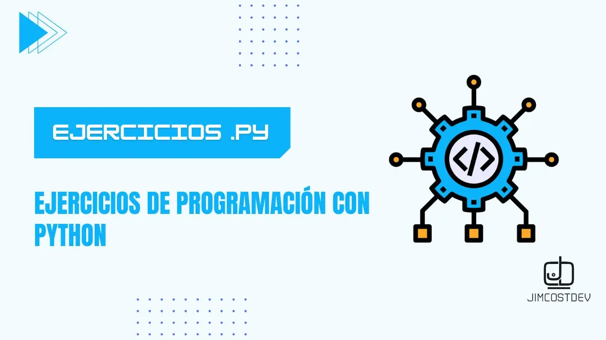

# 🐍 Solucionando problemas de lógica con Python

Bienvenido a mi repositorio de ejercicios y ejemplos de Python. Aquí encontrarás una variedad de problemas para practicar tus habilidades en Python y mejorar tu lógica de programación. ¡Perfecto tanto para principiantes como para programadores más experimentados!



> !Si te resulta útil este proyecto, apóyalo con una ⭐! Tu apoyo nos motiva a crear más contenido y mejorar los recursos disponibles. ¡Gracias! :octocat:

## Instalación

Para clonar y ejecutar los ejercicios localmente, sigue estos pasos:

### Clonar el repositorio

```bash
git clone https://github.com/JimcostDev/Python_Ejercicios.git
```

## Cómo Contribuir

¡Gracias por considerar contribuir! Si deseas agregar más ejercicios, sigue estos pasos:
1. Haz un fork de este repositorio.
2. Crea una rama para tus cambios (`git checkout -b nombre-de-la-rama`).
3. Añade tus ejercicios, asegurándote de incluir comentarios explicativos.
4. Realiza un pull request con tus cambios para que podamos revisarlos y fusionarlos.

## Ejemplo de Ejercicio Resuelto
A continuación, te muestro un ejemplo básico de cómo podría verse un ejercicio resuelto en Python:
```python
# Ejemplo de código resolviendo un ejercicio específico
def mi_funcion(argumentos):
    # Aquí va el código de la solución
    pass
```
## Recursos Adicionales ℹ️

[](https://github.com/JimcostDev)


1. **Aprende Git aquí**: [Mis_Apuntes_Git](https://github.com/JimcostDev/Mis_Apuntes_Git)
2. **Aprende Python aquí:** [python-fundamentals](https://github.com/JimcostDev/python_programming_fundamentals) 
   

## Howdy, soy Ronaldo Jiménez 👋🏻
### Software Engineer & Web Developer :octocat:
<!-- banner -->
[](https://www.youtube.com/@jimcostdev)

[](https://youtube.com/@jimcostdev?sub_confirmation=1)


<!-- frase de EGW -->
[](https://git.io/typing-svg) 
